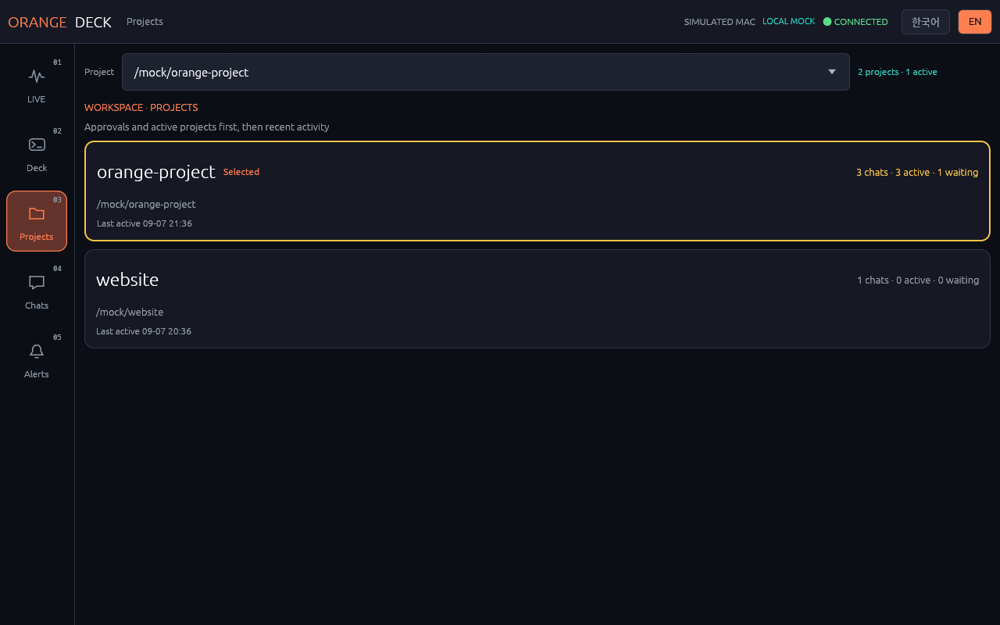
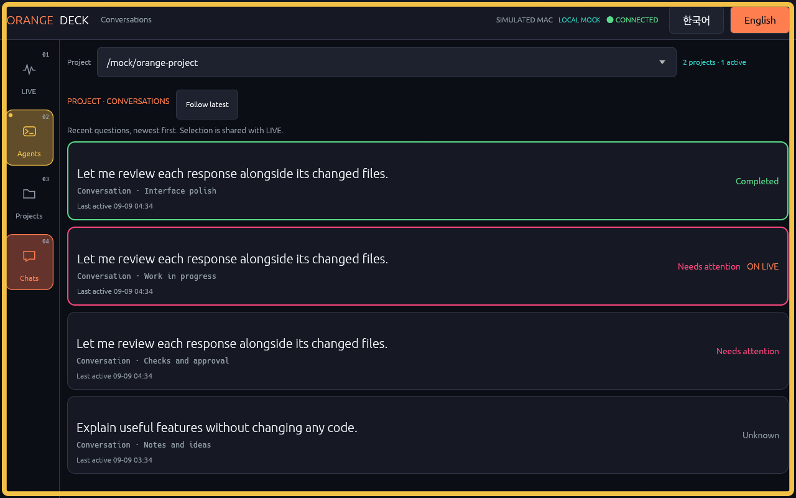
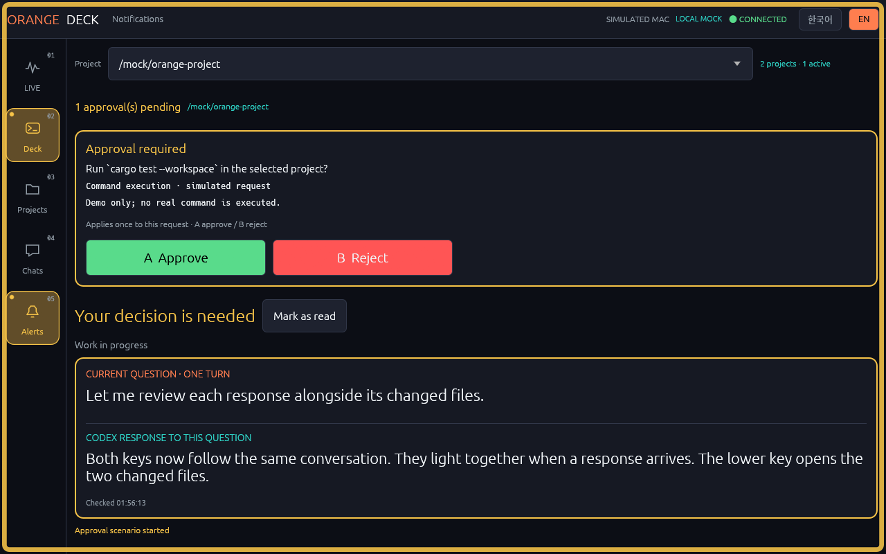
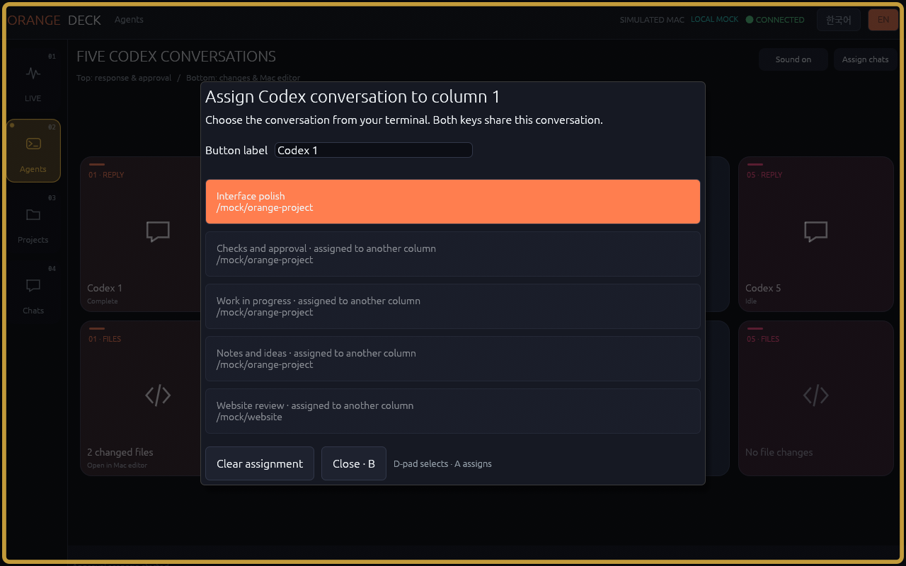

<h3 align="center"><a href="README.md">🇰🇷 한국어</a>　|　🌐 English · current page</h3>

# OrangeDeck

**Follow Codex on your Mac and control it from your ROG Ally.**

**OrangeDeck is a communication and remote-control app.** Codex on your Mac does the AI work. You do not need Codex on the Ally.


[⬇ Download ZIP](https://github.com/Babamba-and-Bibibig/streamdeck_for_rog_ally/archive/refs/heads/main.zip) · [Install](#install) · [See the app](#see-the-app) · [Setup help](docs/INSTALL.en.md)

## Which devices?

**This guide is written for this specific pair of devices.**

| Device | Operating system | What to install |
| --- | --- | --- |
| **Work Mac** — developed around a Mac Studio | **macOS** | Codex CLI + **OrangeDeck Connector**. It sends Codex status and receives button actions from the Ally. |
| **ROG Ally remote** | **CachyOS Handheld · desktop mode** | **OrangeDeck UI**. The app displays work status and sends your button choices. |

**Steam Deck and SteamOS installation and operation have not been tested.** Other Linux distributions are outside this installation guide. Windows is not supported.

Current version: **0.1.24**.

## Install

Follow this order: **set up the Mac → transfer the connection file → set up the Ally**.

Before you start:

- **Both devices:** install [Tailscale](https://tailscale.com/download) and sign in with **the same account**. It connects the two machines.
- **Mac:** install [Codex CLI](https://learn.chatgpt.com/docs/cli) and sign in. You need the terminal version of Codex.
- **Both devices:** Python 3.9 or later is required. [Check or install it](docs/INSTALL.en.md#prerequisites).
- **Both devices:** use **Download ZIP** above, then extract it. Git and SSH keys are not required.

### 1. Install Connector on the Mac

**The three `.command` files below run on the Mac.** For a first installation, double-click them in the extracted folder in order: **1 → 2 → 3**.

| File to run on the Mac | Why run it? | What to do with its window |
| --- | --- | --- |
| **1. Setup OrangeDeck.command** | Installs or updates Connector and prepares your project and connection settings. | **After setup completes**, press Enter when prompted and close the window. |
| **2. Start OrangeDeck Connector.command** | Sends Mac Codex status to the Ally and receives your button actions. | **Keep it open while using OrangeDeck.** |
| **3. Enable Codex Notifications.command** | Connects Codex completion alerts and approval requests to OrangeDeck. | **After configuration completes**, press Enter when prompted and close the window. |

After step 3, open your **usual Mac Codex terminal**, enter **`/hooks`**, and **review and trust the OrangeDeck entry** to finish connecting notifications.

**Only the Connector window from step 2 needs to stay open for OrangeDeck on the Mac. For everyday use, run Start only.** Keep Codex and Tailscale running as usual. Setup and notification configuration are not daily steps. [Update instructions](docs/INSTALL.en.md#update).

When Setup asks for a project folder, choose **the folder you work on with Codex on this Mac**. Press Enter to use the suggested device and project names. Choose `zed`, `vs_code`, `cursor` or `vscodium` for the editor, or Enter for automatic detection.

When setup offers required tools, review the prompt and enter `y` to install them. The first build can take several minutes. If the Mac opens a developer-tools installer, finish it and reopen Setup. [If the command file will not open](docs/INSTALL.en.md#mac-command-file-will-not-open).

### 2. Transfer the Mac's connection file to the Ally

In Mac **Finder → Go → Go to Folder…**, paste:

```text
~/.config/orangedeck
```

Copy **`orangedeck-pairing.toml`** from that folder to **your Ally's Downloads folder**, for example using a USB drive. It contains the settings needed to connect the devices. **Do not upload it to GitHub or chat.**

### 3. Install the remote on the Ally

**The Linux Ally running CachyOS Handheld uses its own commands, not the three Mac files above.** One command installs the remote; another starts it.

**1. To install or update:** use desktop mode, right-click an empty area inside the extracted folder, and choose **Open Terminal Here**. Run the following in the folder containing `install.sh`. It installs the remote and registers the Mac connection file.

```sh
sh install.sh --role ui
```

When asked for the connection file, drag the transferred **`orangedeck-pairing.toml`** into the terminal and press Enter. There is no need to type an IP address or password.

**2. To start the app:** after installation, run this command in the same terminal. Use it for everyday launches too.

```sh
sh "$HOME/.config/orangedeck/start-ui.sh"
```

When launching this way, leave that terminal open while using the app. You do not need to rerun installation for everyday use.

When the Ally shows **연결됨 / CONNECTED**, open **Deck → an upper + key** and assign each terminal's Codex conversation. Then do some Codex work on the Mac. Check that the Ally receives new numbers and completion alerts. When an approval request appears, read it and make a deliberate choice; check that the Mac receives that choice.

If you chose a custom settings folder, use the paths printed by setup. [Setup help, extra settings and updates](docs/INSTALL.en.md).

## See the app

These are app screenshots using **example data**, not personal work. Click a diagram or screenshot to enlarge it. [Screenshot details](docs/SCREENSHOTS.md).

### LIVE — your current work at a glance


See tokens for the current work and your **remaining five-hour and weekly quota**. Numbers update when new usage records arrive. The remaining percentage goes down as you use it.

<table>
<tr>
<td width="50%">
<b>Shortcuts — responses and changed files</b><br>
<a href="docs/screenshots/en-shortcuts.png"></a><br>
Each upper key opens a response; the key directly below opens its changed files. Both keys light together.
</td>
<td width="50%">
<b>Projects — choose a work folder</b><br>
<a href="docs/screenshots/en-projects.png"></a><br>
Pick a folder to show its work across all tabs.
</td>
</tr>
<tr>
<td width="50%">
<b>Conversations — choose a conversation</b><br>
<a href="docs/screenshots/en-conversations.png"></a><br>
Keep one conversation in view, or follow the most recent one automatically.
</td>
<td width="50%">
<b>Notifications — questions, replies and completion</b><br>
<a href="docs/screenshots/en-notifications.png"></a><br>
For a long approval request, open Details and scroll through the inner area to read it all.
</td>
</tr>
</table>

## Connect five conversations

Open **Deck → an upper + key → choose the Codex conversation from your terminal**. Give each column a name. Use **Assign chats** to change or clear a connection. These connections stay fixed when you select another project elsewhere.

| | Terminal 1 | Terminal 2 | Terminal 3 | Terminal 4 | Terminal 5 |
| --- | --- | --- | --- | --- | --- |
| **Upper key** | Response 1 | Response 2 | Response 3 | Response 4 | Response 5 |
| **Key below** | Changed files 1 | Changed files 2 | Changed files 3 | Changed files 4 | Changed files 5 |

- **New response or approval:** both keys in that column pulse, with a notification sound. Use **Sound on/off** to mute it.
- **Upper key:** opens the question and response. If approval is required, review the details and tap **Approve / Reject**. The dialog closes when delivery is confirmed.
- **Lower key:** opens the changed code in your Mac editor and a file list with diffs on the Ally. Tap another file to move the Mac editor to that file.
- **No files changed for that question:** the lower key says **No file changes** and does nothing when pressed.
- **Close a dialog:** tap outside it or **Close**. Dismissing it never approves or rejects anything.

The list contains **file edits Codex recorded for this specific turn**. Changes made through terminal commands or external tools may not appear. Deleted files show their diff without opening an editor. Unavailable or loading data is distinguished from confirmed no changes.

Install **Zed, VS Code, Cursor or VSCodium** on the Mac. Choose your editor during setup, or change your [editor and registered folders](docs/INSTALL.en.md#host-shortcuts) later. File opening is limited to registered Mac project folders.

<table><tr>
<td width="50%"><b>Upper key · response and approval</b><br><a href="docs/screenshots/en-response.png"></a></td>
<td width="50%"><b>Lower key · changed files and diffs</b><br><a href="docs/screenshots/en-files.png"></a></td>
</tr></table>



Use **한국어 / EN** at the top right to switch languages. Language, conversation assignments and sound settings are saved for the next launch.

## Start and stop

**For everyday use: Start on the Mac → launch the app on the Ally.**

| Device | Start each time | Stop |
| --- | --- | --- |
| **Mac** | Double-click **Start OrangeDeck Connector.command** and leave its terminal open. | Press Ctrl+C in the **Connector terminal**. |
| **Ally** | In a terminal, run `sh "$HOME/.config/orangedeck/start-ui.sh"`. | Close the OrangeDeck app window. |

Keep Tailscale running on both devices and Codex on the Mac. Everyday launches do not require Setup, Enable, `install.sh` or another connection-file transfer.

[Launch commands](docs/INSTALL.en.md#start-again) · [Connection or alert problems](docs/INSTALL.en.md#connection-or-alert-problems) · [Update](docs/INSTALL.en.md#update) · [Controls](docs/CONTROLS.md)

## About

Mac work information is sent to your connected Ally. Codex sign-in credentials stay on the Mac. OrangeDeck does not upload your work to GitHub. Keep your connection file and personal settings private.

[Architecture](docs/ARCHITECTURE.md) · [Changelog](docs/CHANGELOG.md) · [Development and publication checks](docs/PUBLICATION.md)

An independent personal project, not an official OpenAI, ASUS or Elgato product. [MIT license](LICENSE).
