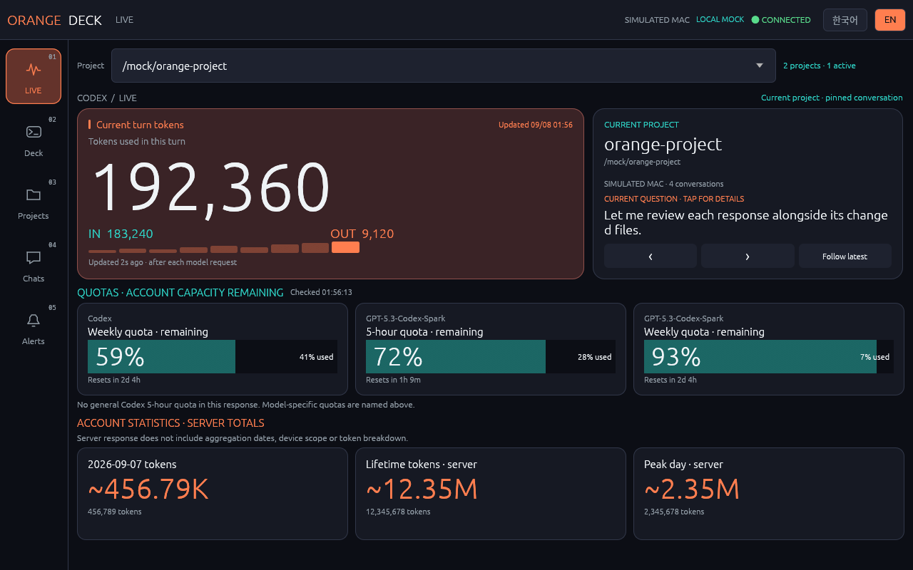
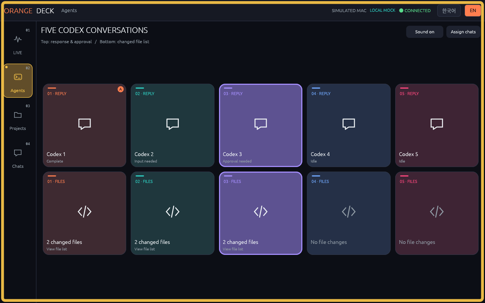
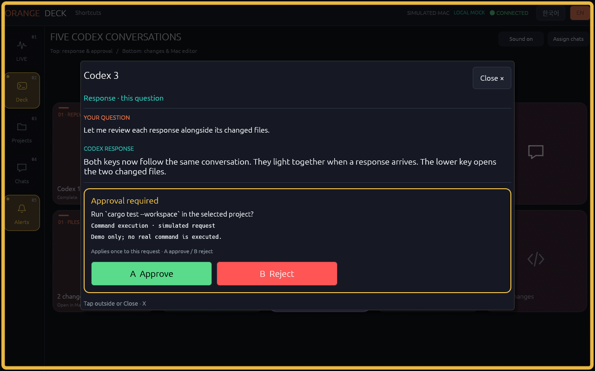
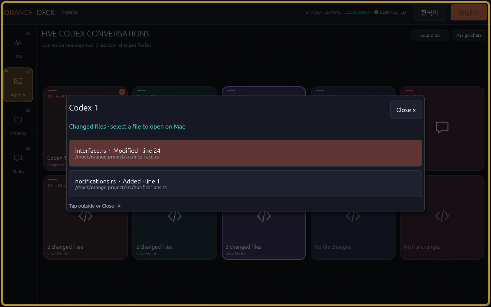
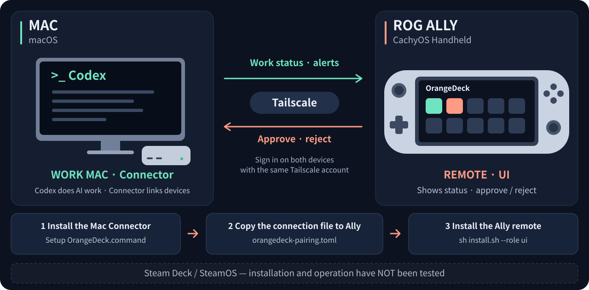

<div align="center">
<table>
<tr>
<td align="center"><h2><a href="README.ko.md">🇰🇷 한국어</a></h2></td>
<td align="center"><h2><a href="README.en.md">🌐 English</a></h2></td>
</tr>
</table>
</div>

<h1 align="center">OrangeDeck</h1>
<h2 align="center">Your Mac's Codex agents.<br>Use a handheld like Steam Deck as your Stream Deck.</h2>

OrangeDeck is a Codex remote for **handheld gaming PCs, the category that includes Steam Deck and ROG Ally**. **Follow progress, read replies and approval requests, and open changed files in your Mac editor.**

Use the **한국어 / English buttons at the top right of the app** to switch languages instantly. OrangeDeck remembers your choice next time.

**Tested setup: Mac Studio (macOS) + ASUS ROG Ally (CachyOS Handheld, desktop mode).**

- **Main PC running Codex and Connector:** macOS only. Linux and Windows hosts are not supported.
- **Handheld remote:** tested on the CachyOS setup above. Windows is not supported. Other Linux distributions, Steam Deck, SteamOS and other handhelds are unverified as remotes.

[⬇ Download ZIP](https://github.com/Babamba-and-Bibibig/streamdeck_for_rog_ally/archive/refs/heads/main.zip) · [Install](#installation) · [Controls](docs/CONTROLS.md)

## LIVE · Current work and remaining quota

### Your question, work status and token records in one view



See the current question, work status, and input/output token records. **Five-hour and weekly limits show the remaining percentage**, so you can see how much of your allowance is left.

Pin one conversation, or turn **Auto ON** to follow the most recent conversation in the selected project.

## Agents · Conversations side by side, actions within reach

### One column, one conversation. Replies above. Files below.



Connect **up to five Codex conversations**. Choose a Mac conversation with an **upper + key** once; OrangeDeck remembers it next time.

A new reply or approval request makes **both keys in its column pulse, with a notification sound**. You can see which conversation needs attention and turn sound on or off.

### ① Upper key · Read the reply and review each request

Read your question and Codex's reply. When an approval request arrives, review the details and choose **Approve / Reject** yourself. Your decision applies **only to the request currently displayed**.



Tap outside the dialog or **Close** to dismiss it without sending an approval or rejection.

### ② Lower key · Check the file list, then choose what to open

**Lower key → file names and full paths → select a file → Mac editor**



The lower key opens **only the changed file list for this question**. **Selecting a file in the list** opens your Mac editor at its recorded changed line. Review code in that editor. If no line is recorded, the file opens at the first line.

**The connected Codex conversation supplies the working folder automatically.** No extra folder registration is needed. Zed, VS Code, Cursor and VSCodium are supported. File events capture changed paths without scanning the whole project again.

A confirmed empty edit record shows **No file changes**. [File lists, retry and editor settings](docs/INSTALL.en.md#host-shortcuts).

All screenshots use **simulated data**. Click a screenshot to enlarge it. [Explore all app screens](docs/SCREENSHOTS.md).

## How the two devices connect

The diagram below shows **the tested Mac Studio + ASUS ROG Ally setup**.



**Codex does the AI work on the Mac. OrangeDeck connects the devices.** You do not need to install Codex on the handheld remote.

| Role | Tested device and OS | Install |
| --- | --- | --- |
| **Main PC** | Mac Studio · macOS | Codex CLI + OrangeDeck **Connector** |
| **Handheld remote** | ASUS ROG Ally · CachyOS Handheld, desktop mode | OrangeDeck **remote UI** |

**CachyOS is a Linux distribution; it runs the remote in this setup.** The Mac `.command` files set up and run Connector on the main PC. The remote uses `install.sh` for installation.

## Installation

**Set up the Mac → transfer the connection file → install the handheld remote.** Current version: **0.1.34**.

Install [Tailscale](https://tailscale.com/download) on both devices and sign in with the same account. Install [Codex CLI](https://learn.chatgpt.com/docs/cli) on the Mac and sign in. Both devices need Python 3.9 or later. [Check prerequisites](docs/INSTALL.en.md#prerequisites).

On both devices, use **Download ZIP** above and extract it. Git and SSH keys are not needed.

### 1. Install Connector on the Mac

**These three files run on the Mac.** In the extracted folder, double-click them in order.

1. **Setup OrangeDeck.command** — install Connector and choose your work folder and editor. When setup finishes, press Enter as prompted and close the window.
2. **Start OrangeDeck Connector.command** — connect the Mac and handheld. **Keep this window open while using OrangeDeck.**
3. **Enable Codex Notifications.command** — connect completion alerts and approval requests. When configuration finishes, press Enter and close the window.

Finally, open **`/hooks` in your usual Mac Codex session → review and trust OrangeDeck**. The only OrangeDeck window you need to keep open is **step 2, Connector**.

If a developer-tool installer appears, finish it and run Setup again. [Mac setup help](docs/INSTALL.en.md#mac-command-file-will-not-open).

### 2. Transfer the Mac's connection file to your handheld

In Mac **Finder → Go → Go to Folder…**, open `~/.config/orangedeck`.

Copy **`orangedeck-pairing.toml`** to **your handheld's Downloads folder** using USB or another private transfer. This **personal connection file** contains your Mac's address and secret connection credential. Do not post it on GitHub or in a chat.

### 3. Install the remote UI on your handheld

This step covers **ROG Ally running CachyOS Handheld in desktop mode**. Open the extracted folder, right-click an empty area and select **Open Terminal Here**. Use this command instead of the Mac `.command` files:

```sh
sh install.sh --role ui
```

When asked for a connection file, drag **`orangedeck-pairing.toml`** into the terminal and press Enter. You do not need to type an IP address or credential.

After installation, start the app:

```sh
sh "$HOME/.config/orangedeck/start-ui.sh"
```

When it shows **CONNECTED**, open **Agents → an upper + key** and assign a conversation. Use Codex on the Mac to check new LIVE records, replies and changed files on your handheld.

## Next time, just start the apps

| Device | Start | Stop |
| --- | --- | --- |
| **Mac** | Double-click **Start OrangeDeck Connector.command** | Press Ctrl+C in the Connector terminal |
| **Handheld PC** | `sh "$HOME/.config/orangedeck/start-ui.sh"` | Close the OrangeDeck window |

Keep Codex and Tailscale running. If you launch the app from a terminal, keep that terminal open too. Setup, Enable and installation are not daily steps.

<a id="my-settings"></a>

### Updates keep your settings

First setup creates each device's settings and your personal connection file. Updating the same devices keeps your **work folder, editor, connection, language, conversation assignments and sound setting**. Private settings live under `~/.config/orangedeck/` on each device and are not included in downloads. [Update steps](docs/INSTALL.en.md#update) · [Why setup does not ask again](docs/INSTALL.en.md#saved-settings).

[Controls and everyday use](docs/CONTROLS.md) · [Setup and connection help](docs/INSTALL.en.md) · [한국어 안내](README.ko.md) · [Changelog](docs/CHANGELOG.md)

## Use terms

**You may inspect the source and install and use OrangeDeck without modifying it. Modifying, redistributing or selling OrangeDeck requires prior written permission.** You can freely change your settings and work on your own files. [License](LICENSE) · [Third-party library and font notices](THIRD_PARTY_NOTICES.md). Third-party components and copies received under earlier licenses retain their separate terms.
