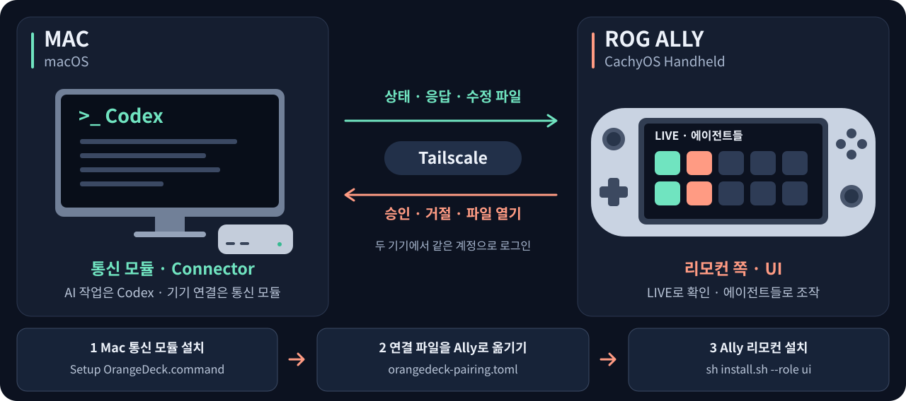
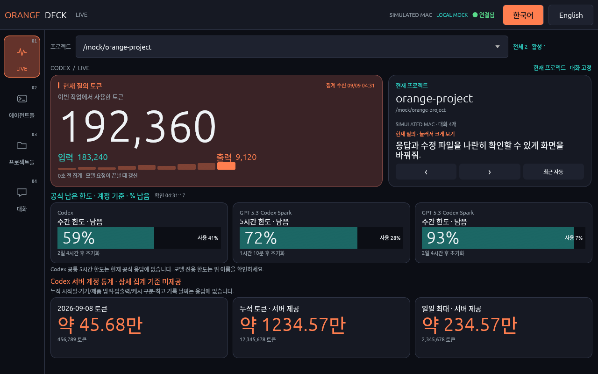
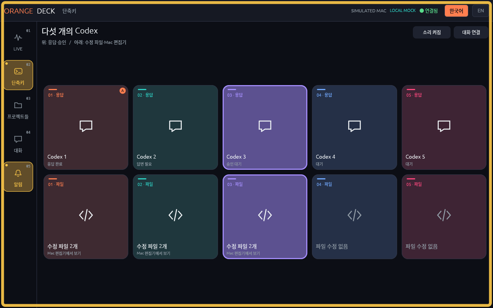
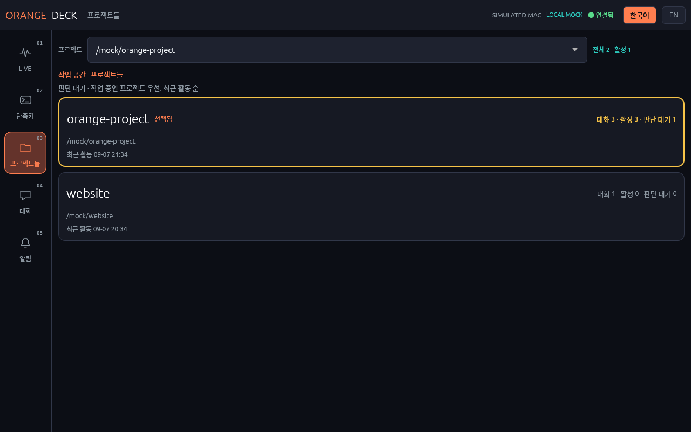
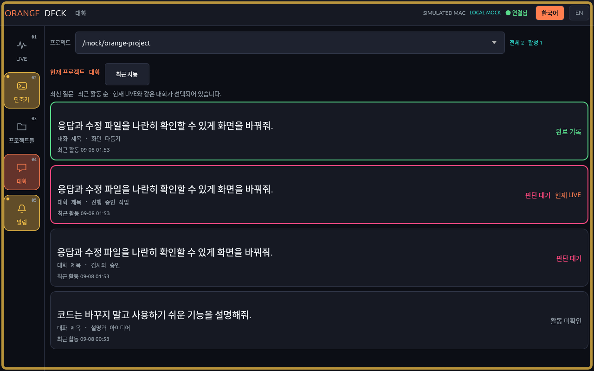
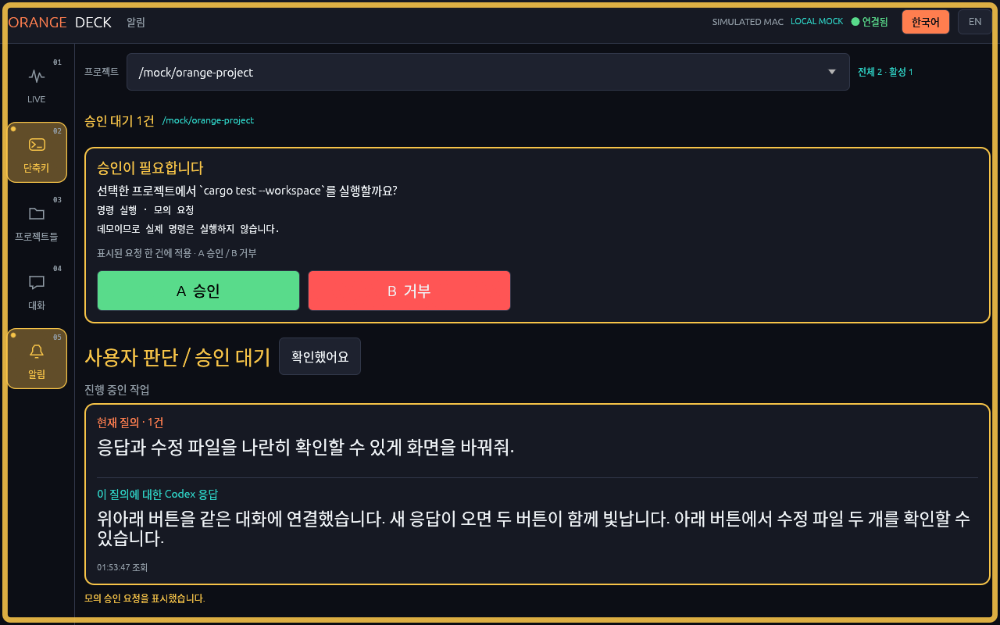
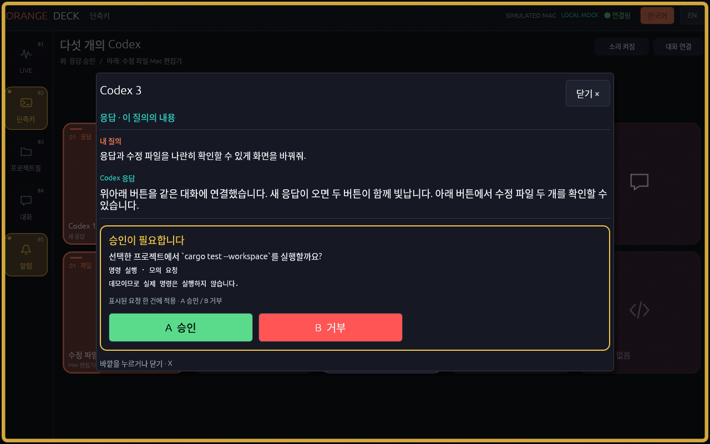
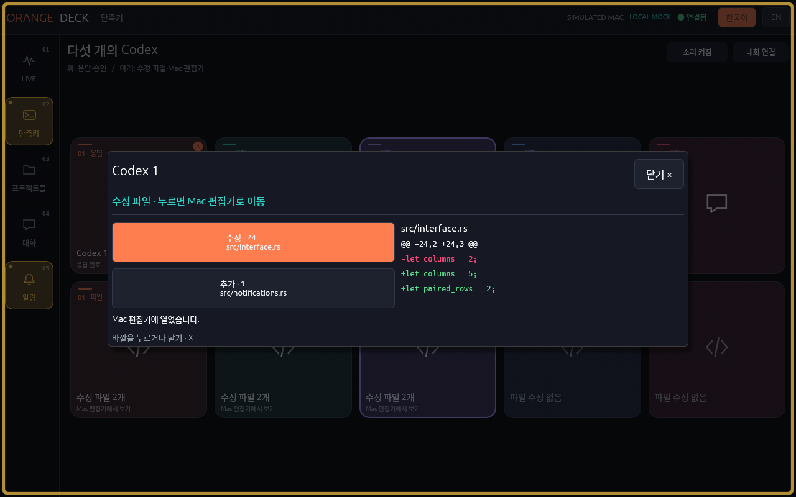
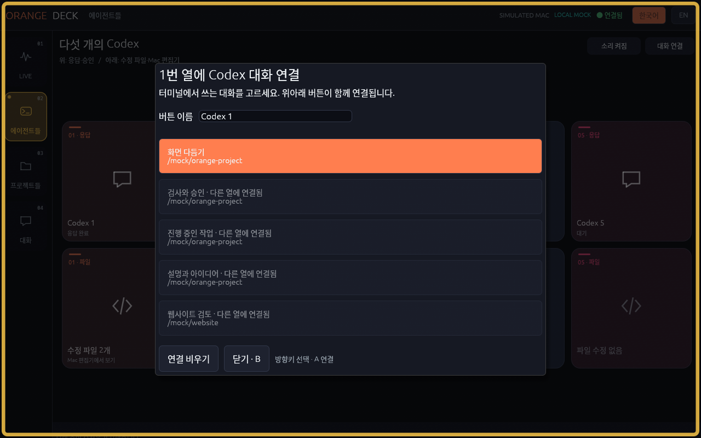

<h3 align="center">🇰🇷 한국어 · 현재 페이지　|　<a href="README.en.md">🌐 English</a></h3>

# OrangeDeck

**Mac에서 돌아가는 Codex를 ROG Ally로 확인하고 조작하세요.**

**OrangeDeck은 Mac과 Ally를 연결하는 통신·리모컨 앱입니다.** AI 작업은 Mac의 Codex가 합니다. Ally에는 Codex를 설치할 필요가 없습니다.



[⬇ ZIP 다운로드](https://github.com/Babamba-and-Bibibig/streamdeck_for_rog_ally/archive/refs/heads/main.zip) · [설치하기](#설치하기) · [앱 화면 보기](#앱-화면-보기) · [간단 사용법](docs/QUICKSTART_KO.md)

## 설치할 기기

**이 설명서는 아래 두 기기를 연결하는 방법을 안내합니다.**

| 기기 | 운영체제 | 설치할 것 |
| --- | --- | --- |
| **작업용 Mac** — Mac Studio를 기준으로 개발 | **macOS** | Codex CLI + **통신 모듈(Connector)**. Codex 상태를 보내고 Ally의 버튼 입력을 받습니다. |
| **리모컨용 ROG Ally** | **CachyOS Handheld · 데스크톱 모드** | **OrangeDeck 리모컨(UI)**. 작업 상태를 보고 버튼을 누르는 앱입니다. |

**Steam Deck·SteamOS는 설치와 동작을 아직 확인하지 않았습니다.** 다른 Linux 배포판도 이 설명서의 설치 대상에 포함하지 않습니다. Windows는 지원하지 않습니다.

현재 버전: **0.1.24**.

## 설치하기

순서는 **Mac 설치 → 연결 파일 옮기기 → Ally 설치**입니다.

먼저 준비하세요.

- **두 기기:** [Tailscale](https://tailscale.com/download)을 설치하고 **같은 계정**으로 로그인합니다. 두 기기를 연결해 주는 프로그램입니다.
- **Mac:** [Codex CLI](https://learn.chatgpt.com/docs/cli)를 설치하고 로그인해 둡니다. 터미널에서 쓰는 Codex가 필요합니다.
- **두 기기:** Python 3.9 이상이 필요합니다. [확인·설치 방법](docs/INSTALL.md#준비물)을 참고하세요.
- **두 기기:** 위의 **ZIP 다운로드**를 누르고 압축을 풉니다. Git이나 SSH 키는 필요하지 않습니다.

### 1. Mac에 통신 모듈 설치

**아래 세 `.command` 파일은 Mac에서 실행합니다.** 처음 설치할 때 압축을 푼 폴더에서 **① → ② → ③** 순서로 파일을 두 번 누르세요.

| Mac에서 실행할 파일 | 왜 실행하나요? | 열린 창은 어떻게 하나요? |
| --- | --- | --- |
| **① Setup OrangeDeck.command** | 통신 모듈을 설치하고 작업 폴더·연결 설정을 준비합니다. 업데이트할 때도 씁니다. | **설치 완료 후** 안내에 따라 Enter를 누르고 닫습니다. |
| **② Start OrangeDeck Connector.command** | Mac의 Codex 상태를 Ally로 보내고, Ally에서 누른 버튼을 받습니다. | **OrangeDeck을 사용하는 동안 켜 둡니다.** |
| **③ Enable Codex Notifications.command** | Codex의 완료 알림과 승인 요청을 OrangeDeck에 연결합니다. | **설정 완료 후** 안내에 따라 Enter를 누르고 닫습니다. |

③이 끝나면 **평소 사용하는 Mac Codex 터미널**에서 **`/hooks` → OrangeDeck 항목 확인·신뢰**를 진행하세요. 여기까지 해야 알림 연결이 끝납니다.

**Mac에서 계속 켜둘 OrangeDeck 창은 ② 통신 모듈 하나입니다. 다음부터는 ② Start만 실행하면 됩니다.** Codex와 Tailscale은 평소처럼 켜 두세요. 설치·알림 설정은 매번 다시 하지 않습니다. [업데이트할 때의 순서](docs/INSTALL.md#업데이트).

Setup이 작업 폴더를 물으면 **Mac에서 Codex로 작업할 폴더**를 넣습니다. 기기 이름과 프로젝트 이름은 Enter로 기본값을 써도 됩니다. 편집기는 `zed`, `vs_code`, `cursor`, `vscodium` 중에서 고르거나 Enter로 자동 선택합니다.

필요한 도구를 설치할지 물으면 내용을 읽고 `y`를 입력하세요. 첫 설치는 몇 분 이상 걸릴 수 있습니다. Mac 개발 도구 설치 창이 뜨면 설치를 마친 뒤 Setup 파일을 다시 여세요. [파일이 안 열릴 때](docs/INSTALL.md#mac-설치-파일이-안-열릴-때).

### 2. Mac의 연결 파일을 Ally로 옮기기

Mac **Finder → 이동 → 폴더로 이동…**에서 아래 경로를 붙여넣으세요.

```text
~/.config/orangedeck
```

그 안의 **`orangedeck-pairing.toml`**을 USB 등으로 **내 Ally의 다운로드 폴더**에 옮깁니다. 두 기기를 연결할 때 쓰는 파일입니다. **이 파일은 GitHub나 채팅에 올리지 마세요.**

### 3. Ally에 리모컨 설치

**Ally의 Linux(CachyOS Handheld)에서는 위의 Mac용 세 파일을 실행하지 않습니다.** 리모컨을 **설치하는 명령 하나**, **켜는 명령 하나**를 씁니다.

**① 설치·업데이트할 때:** 데스크톱 모드에서 압축을 푼 폴더의 빈 곳을 오른쪽 클릭해 **여기서 터미널 열기**를 누릅니다. `install.sh`가 있는 폴더에서 아래 명령을 입력하세요. 리모컨을 설치하고 Mac 연결 파일을 등록합니다.

```sh
sh install.sh --role ui
```

연결 파일을 물으면 방금 옮긴 **`orangedeck-pairing.toml`**을 터미널에 끌어 놓고 Enter를 누릅니다. IP 주소나 비밀번호를 따로 적을 필요는 없습니다.

**② 앱을 켤 때:** 설치가 끝나면 같은 터미널에서 아래 명령을 입력합니다. 다음부터도 이 명령으로 켜면 됩니다.

```sh
sh "$HOME/.config/orangedeck/start-ui.sh"
```

이 명령으로 앱을 띄웠다면 사용하는 동안 그 터미널도 켜 두세요. 설치 명령은 평소에 다시 실행하지 않습니다.

Ally에 **연결됨**이 뜨면 **단축키 → 위쪽 + 버튼**에서 각 터미널의 Codex 대화를 연결하세요. 그다음 Mac에서 Codex 작업을 해 보세요. Ally의 숫자와 완료 알림이 바뀌는지 확인합니다. 승인 요청이 생기면 내용을 읽고 직접 눌러 Mac에도 전달되는지 확인하세요.

설정 폴더를 따로 지정했다면 설치 끝에 나온 경로를 사용하세요. [설치가 막힐 때·추가 설정·업데이트](docs/INSTALL.md).

## 앱 화면 보기

사진은 개인 작업 대신 **예제 데이터**로 실행한 앱 화면입니다. 그림이나 사진을 누르면 크게 볼 수 있습니다. [촬영 정보](docs/SCREENSHOTS.md).

### LIVE — 지금 하는 작업을 한눈에



지금 하는 작업의 토큰과 **5시간·주간 남은 사용량**을 봅니다. 숫자는 새 사용 기록을 받으면 바뀝니다. 남은 비율은 쓸수록 줄어듭니다.

<table>
<tr>
<td width="50%">
<b>단축키 — 다섯 대화의 응답과 수정 파일</b><br>
<a href="docs/screenshots/shortcuts.png"></a><br>
위 버튼은 응답, 바로 아래 버튼은 수정 파일입니다. 같은 대화의 두 버튼이 함께 깜빡입니다.
</td>
<td width="50%">
<b>프로젝트들 — 작업 폴더 선택</b><br>
<a href="docs/screenshots/projects.png"></a><br>
폴더를 고르면 다른 탭에서도 그 폴더의 작업을 보여줍니다.
</td>
</tr>
<tr>
<td width="50%">
<b>대화 — 확인할 대화 선택</b><br>
<a href="docs/screenshots/conversations.png"></a><br>
한 대화를 계속 보거나, 가장 최근 대화가 자동으로 보이게 할 수 있습니다.
</td>
<td width="50%">
<b>알림 — 질문·답변·완료 확인</b><br>
<a href="docs/screenshots/notifications.png"></a><br>
승인할 내용이 길면 요청 상세를 열고 안쪽을 스크롤해 끝까지 읽으세요.
</td>
</tr>
</table>

## 다섯 대화 연결하기

**단축키 → 위쪽 + 버튼 → 터미널의 Codex 대화 선택**으로 연결합니다. 버튼 이름도 직접 정할 수 있습니다. 바꾸려면 **대화 연결**을 누르고 위 버튼을 고르세요. 다른 프로젝트를 보고 있어도 연결한 대화는 바뀌지 않습니다.

| | 첫 번째 터미널 | 두 번째 터미널 | 세 번째 터미널 | 네 번째 터미널 | 다섯 번째 터미널 |
| --- | --- | --- | --- | --- | --- |
| **위 버튼** | 응답 1 | 응답 2 | 응답 3 | 응답 4 | 응답 5 |
| **바로 아래** | 수정 파일 1 | 수정 파일 2 | 수정 파일 3 | 수정 파일 4 | 수정 파일 5 |

- **새 응답·승인 요청:** 같은 열의 두 버튼이 함께 깜빡이고 알림음이 납니다. **소리 켜짐/꺼짐**로 끌 수 있습니다.
- **위 버튼:** 질문과 응답을 창으로 보여줍니다. 승인할 일이 있으면 내용을 읽고 **승인 / 거부**를 누르세요. Mac에 전달되면 창이 닫힙니다.
- **아래 버튼:** Mac 편집기를 열고 수정한 코드 위치로 이동합니다. Ally에는 수정 파일 목록과 변경 내용이 뜹니다. 목록에서 다른 파일을 누르면 Mac도 그 파일로 이동합니다.
- **파일을 수정하지 않은 질의:** 아래 버튼에 **파일 수정 없음**이 뜹니다. 눌러도 창이나 편집기는 열리지 않습니다.
- **창 닫기:** 창 바깥이나 **닫기**를 누르세요. 닫는 것만으로 승인·거절되지는 않습니다.

수정 파일은 **해당 질의에서 Codex가 기록한 파일 편집**을 보여줍니다. 터미널 명령이나 외부 도구가 바꾼 파일은 기록에 없을 수 있습니다. 삭제한 파일은 변경 내용만 보여주며, 아직 정보를 받지 못한 경우는 ‘파일 수정 없음’과 구분합니다.

Mac에는 **Zed·VS Code·Cursor·VSCodium** 중 하나를 설치하세요. 처음 설치할 때 고르며, 나중에 [편집기·작업 폴더 설정](docs/INSTALL.md#host-shortcuts)을 바꿀 수 있습니다. 파일 열기는 Mac에 등록한 작업 폴더 안에서만 가능합니다.

<table><tr>
<td width="50%"><b>위 버튼 · 응답과 승인</b><br><a href="docs/screenshots/response.png"></a></td>
<td width="50%"><b>아래 버튼 · 수정 파일과 변경 내용</b><br><a href="docs/screenshots/files.png"></a></td>
</tr></table>



오른쪽 위 **한국어 / EN**으로 언어를 바꿉니다. 언어·대화 연결·알림음 설정은 다음 실행에도 유지됩니다.

## 다시 켜기·끄기

**평소에는 Mac에서 Start → Ally에서 앱 실행**, 이것만 하면 됩니다.

| 기기 | 매번 켤 때 | 끌 때 |
| --- | --- | --- |
| **Mac** | **Start OrangeDeck Connector.command**를 두 번 누르고 터미널을 켜 둡니다. | **통신 모듈 터미널**에서 Ctrl+C |
| **Ally** | 터미널에서 `sh "$HOME/.config/orangedeck/start-ui.sh"` | OrangeDeck 앱 창 닫기 |

두 기기의 Tailscale과 Mac의 Codex는 켜 두세요. 평소에는 Setup·Enable·`install.sh`를 다시 실행하거나 연결 파일을 다시 옮길 필요가 없습니다.

[실행 명령·버튼 조작](docs/QUICKSTART_KO.md) · [연결이 안 될 때](docs/INSTALL.md#연결이나-알림이-안-될-때) · [업데이트](docs/INSTALL.md#업데이트)

## 참고

Mac의 작업 정보는 연결한 Ally로 보냅니다. Codex 로그인 정보는 Mac에 남으며, OrangeDeck이 작업 내용을 GitHub로 보내지는 않습니다. 연결 파일과 개인 설정은 공개하지 마세요.

[개발 구조](docs/ARCHITECTURE.md) · [변경 내역](docs/CHANGELOG.md) · [개발·게시 검사](docs/PUBLICATION.md)

OpenAI·ASUS·Elgato의 공식 제품이 아닌 개인 프로젝트입니다. [MIT 라이선스](LICENSE).
