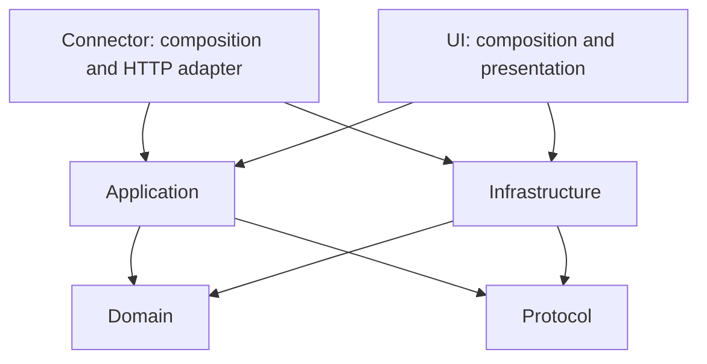

# Architecture

OrangeDeck separates state and command policy from operating-system, Codex, network and UI adapters. Connector and UI are the composition roots. Installation and publication are independent tools; the running Rust applications do not depend on Python.

## Runtime topology

```text
ROG Ally / CachyOS Handheld            Mac / macOS
orangedeck-ui                          orangedeck-connector
  egui rendering                        authenticated axum endpoints
  touch / mouse / controller            command validation + project allow-list
  background network worker  <--------> HTTP / WebSocket state and events
                             Tailscale      |
                              +-------------+---------------------+
                              |             |                     |
                         Codex adapter   bounded process jobs   reviewed hooks
                         local stdio     Cargo / read-only Git  private Unix socket
                              |
                         Codex CLI app-server
```

This is the pairing covered by the installation guide: macOS Connector and a CachyOS Handheld ROG Ally remote in desktop mode. Steam Deck and SteamOS are untested. Other platform adapters and development paths do not establish successful installation on those systems.

The Connector starts Codex App Server locally and owns its stdio and lifecycle. App Server is not exposed as a network listener. Existing independent Codex sessions are monitored read-only; reviewed hooks supply a separate, explicit approval channel.

## Dependency rules

Arrows indicate permitted workspace dependencies. Neither inner crate imports an application or infrastructure adapter.



| Crate | Responsibility |
| --- | --- |
| `orangedeck-domain` | State, project registration and invariants. No egui, axum, filesystem, process or network APIs. |
| `orangedeck-protocol` | Versioned serializable commands, snapshots and events. No operating-system behavior. |
| `orangedeck-application` | Command validation, state mapping, shared dashboard and reconnect policy. Depends on domain/protocol and synchronization utilities, never infra or apps. |
| `orangedeck-infra` | Configuration, private credentials, Tailscale discovery, Codex stdio/history, process and filesystem adapters. |
| `orangedeck-connector` | Selects paths and concrete backend at startup; composes authenticated routes, jobs, hooks and state publication. |
| `orangedeck-ui` | Composes rendering, scoped selection, explicit input handling and background network workers. |

`python3 scripts/check_architecture.py` checks Cargo manifests for forbidden workspace dependencies, unreviewed local paths and framework imports into domain/protocol. CI runs this check. It is a guard against boundary regressions; behavior and data flow still need code review. The application layer currently uses Tokio synchronization; it does not own network or process execution.

The 0.1.19 installation fix follows these boundaries: `ConnectorPaths` in the Connector composition root resolves the selected configuration's directory, then supplies the hook socket and owned-thread registry locations to the concrete backend. Inner state policy does not select a user's home directory. Separate configurations have separate registries and sockets.

## Concurrency and actions

The egui thread renders and handles input without network or process I/O. A dedicated Tokio runtime handles HTTP, WebSocket and reconnect backoff. Disconnected UI commands are rejected rather than replayed later. Bounded broadcast state uses replacement snapshots when a client falls behind.

Cargo jobs read stdout/stderr independently and retain a bounded 250-line tail. One Cargo job runs at a time. Unix process groups receive TERM and then KILL after a two-second grace period when cancelled. These typed backend actions remain available to authenticated clients even though the current UI focuses on monitoring and approvals. Registered repositories must be trusted because build scripts can execute code.

## Codex state and ownership

The adapter's recorded schema baseline is Codex CLI 0.153.2. Other versions receive compatibility diagnostics and runtime validation. The ownership registry is stored alongside the active Connector configuration. Unowned conversations remain external and read-only; app-server prompts, interrupts and approvals require OrangeDeck ownership. Reviewed hook approvals are independently tied to the displayed pending request.

The Connector polls conversation/activity information approximately every five seconds, quotas every fifteen seconds and account statistics every sixty seconds. Source records are bounded; no missing field is fabricated. Account summary values are forwarded as supplied, without claiming a verified aggregation scope. Five-hour and weekly bars show **100% minus official usage**, not an estimated number of remaining tokens.

Session-usage reads accept only app-server-provided paths for listed thread IDs. Canonical paths must stay under the selected `CODEX_HOME/sessions`, with matching rollout names and session metadata. Reads are regular-file, bounded and read-only; there is no general disk crawl or client-selected file path. Only the selected/latest conversation's bounded question and response text is forwarded; hidden reasoning is excluded.

A valid baseline permits a current-turn token delta. Otherwise the UI explicitly labels the latest model request. New turns clear previous readings. Completed readings retain their timestamp; stale or disconnected data is distinguished from current activity. Counts update at model-request boundaries, not for every generated token. Rollout records are an internal integration and can change with Codex versions.

The five tabs are LIVE, shortcuts, projects, conversations and notifications. They share project/conversation/current-turn selection. Recent automatic selection stays within the selected project. A new actionable approval for that turn opens shortcuts once. The deck contains two fixed decision keys and eight customizable keys from a finite 14-action catalog. Arbitrary shell macros are not exposed.

The 0.1.20 preferences follow the same inward dependency rules: domain owns the language,
finite shortcut catalog and fixed-key invariant; application resolves a shortcut into local
navigation or a typed registered-project command; infrastructure reads bounded private
preferences and writes them atomically with mode 0600. The UI composition root chooses
`ui-preferences.toml` beside the active UI config. Rendering uses a per-window language;
user content is not translated. Preference writes are small synchronous file operations on
explicit user changes, separate from network and process workers. Corrupt or newer-schema
files are preserved and a visible warning explains that the session cannot save them.
Demo preferences are ephemeral. The action editor intercepts A/B and suppresses background
approval routing; assignment never executes the selected action.

## Hook and input boundary

The hook directory and Unix socket are private, and connections require the same local user. `codex-hooks --install --config ...` merges OrangeDeck handlers into the selected Codex profile's `hooks.json`, preserving unrelated hooks and making a private backup. Codex trust is established by the user through `/hooks`; the installer never writes trust hashes or approval policy.

Permission requests carry bounded complete action details and wait up to 120 seconds for an explicit authenticated decision. An unavailable Connector, timeout or no user decision falls back to Codex's ordinary approval handling. Completion/stop events are deduplicated across hooks and newly appended history records; initial history does not replay old alerts. The Connector retains a bounded notification history in memory, not a durable audit database.

UI decisions require fresh input for the displayed actionable request. Gray/disabled states block approval, reconnect does not replay decisions, and dismissing an alert cannot approve an obscured request. Controller input is consumed only while the window is focused; touch and mouse remain available independently of controller access.

## Installation and publication

`scripts/install.py` is a standard-library Python tool that checks prerequisites, builds locked Rust source, writes private per-user configuration and generates explicit launchers. It preserves existing pairing and Codex profile selection, validates existing configuration before replacing a binary, and records no credentials in source files. It does not start a login service or automatically trust hooks.

`download-page/` packages and verifies the same allow-listed source for ZIP, TAR and GitHub export. Its optional tailnet download server is separate from installation and the Rust runtime. `.gitignore` defaults to excluding new files; reviewed source extensions and named documents are explicitly allowed. Packaging and Git index/history scans enforce the public-source policy separately. See [publication and incident handling](PUBLICATION.md).

Windows support is deferred. Future platform work belongs in outer adapters and composition, preserving the domain and wire contract boundaries.
