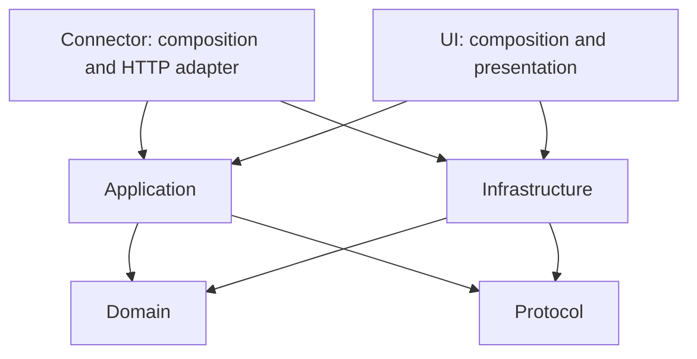

# Architecture

OrangeDeck separates state and command policy from operating-system, Codex, network and UI adapters. Connector and UI are the composition roots. Installation and publication are independent tools; the running Rust applications do not depend on Python.

## Runtime topology

```text
ROG Ally / CachyOS Handheld            Mac / macOS
orangedeck-ui                          orangedeck-connector
  egui rendering                        authenticated axum endpoints
  touch / mouse / controller            command validation + project allow-list
  background network worker  <--------> HTTP / WebSocket state and events
                             Tailscale      |
                              +-------------+---------------------+
                              |             |                     |
                         Codex adapter   bounded process jobs   reviewed hooks
                         local stdio     Cargo / read-only Git  private Unix socket
                              |
                         Codex CLI app-server
```

This is the pairing covered by the installation guide: macOS Connector and a CachyOS Handheld ROG Ally remote in desktop mode. Steam Deck and SteamOS are untested. Other platform adapters and development paths do not establish successful installation on those systems.

The Connector starts Codex App Server locally and owns its stdio and lifecycle. App Server is not exposed as a network listener. Existing independent Codex sessions are monitored read-only; reviewed hooks supply a separate, explicit approval channel.

## Dependency rules

Arrows indicate permitted workspace dependencies. Neither inner crate imports an application or infrastructure adapter.



| Crate | Responsibility |
| --- | --- |
| `orangedeck-domain` | State, project registration and invariants. No egui, axum, filesystem, process or network APIs. |
| `orangedeck-protocol` | Versioned serializable commands, snapshots and events. No operating-system behavior. |
| `orangedeck-application` | Command validation, state mapping, shared dashboard and reconnect policy. Depends on domain/protocol and synchronization utilities, never infra or apps. |
| `orangedeck-infra` | Configuration, private credentials, Tailscale discovery, Codex stdio/history, process and filesystem adapters. |
| `orangedeck-connector` | Selects paths and concrete backend at startup; composes authenticated routes, jobs, hooks and state publication. |
| `orangedeck-ui` | Composes rendering, scoped selection, explicit input handling and background network workers. |

`python3 scripts/check_architecture.py` checks Cargo manifests for forbidden workspace dependencies, unreviewed local paths and framework imports into domain/protocol. CI runs this check. It is a guard against boundary regressions; behavior and data flow still need code review. The application layer currently uses Tokio synchronization; it does not own network or process execution.

The 0.1.19 installation fix follows these boundaries: `ConnectorPaths` in the Connector composition root resolves the selected configuration's directory, then supplies the hook socket and owned-thread registry locations to the concrete backend. Inner state policy does not select a user's home directory. Separate configurations have separate registries and sockets.

## Concurrency and actions

The egui thread renders and handles input without network or process I/O. A dedicated Tokio runtime handles HTTP, WebSocket and reconnect backoff. Disconnected UI commands are rejected rather than replayed later. Bounded broadcast state uses replacement snapshots when a client falls behind.

Cargo jobs read stdout/stderr independently and retain a bounded 250-line tail. One Cargo job runs at a time. Unix process groups receive TERM and then KILL after a two-second grace period when cancelled. These typed backend actions remain available to authenticated clients even though the current UI focuses on monitoring and approvals. Registered repositories must be trusted because build scripts can execute code.

## Codex state and ownership

The adapter's recorded schema baseline is Codex CLI 0.153.2. Other versions receive compatibility diagnostics and runtime validation. The ownership registry is stored alongside the active Connector configuration. Unowned conversations remain external and read-only; app-server prompts, interrupts and approvals require OrangeDeck ownership. Reviewed hook approvals are independently tied to the displayed pending request.

The Connector polls conversation/activity information approximately every five seconds, quotas every fifteen seconds and account statistics every sixty seconds. Source records are bounded; no missing field is fabricated. Account summary values are forwarded as supplied, without claiming a verified aggregation scope. Five-hour and weekly bars show **100% minus official usage**, not an estimated number of remaining tokens.

Session-usage reads accept only app-server-provided paths for listed thread IDs. Canonical paths must stay under the selected `CODEX_HOME/sessions`, with matching rollout names and session metadata. Reads are regular-file, bounded and read-only; there is no general disk crawl or client-selected file path. Bounded question/response text and recorded file edits are read for the latest, selected and up to five assigned deck conversations; hidden reasoning is excluded.

A valid baseline permits a current-turn token delta. Otherwise the UI explicitly labels the latest model request. New turns clear previous readings. Completed readings retain their timestamp; stale or disconnected data is distinguished from current activity. Counts update at model-request boundaries, not for every generated token. Rollout records are an internal integration and can change with Codex versions.

The four tabs are LIVE, Agents, Projects and Conversations. LIVE, Projects and Conversations share project/current-turn selection. Agents independently pins five stable conversation IDs, with response keys above changed-file keys. Notices pulse each pair without switching pages or opening a dialog automatically. Y and the old notification entry points open Agents; approvals are available only inside the displayed response dialog.

Domain owns conversation slots, language, sound preference and recorded turn changes. Application validates the exact conversation, turn and recorded change. The Connector takes the working folder from that known Codex conversation automatically. Infrastructure canonicalizes the cwd, parses completed Codex `fileChange` items, captures local tool-time file changes, bounds file counts/diffs, resolves canonical files inside that conversation folder, and launches only fixed editor adapters using literal argument lists. A project-wide Git diff is never attributed to one Codex turn.

The opt-in `PreToolUse`/`PostToolUse` hooks use the existing private socket and match `Bash`, `apply_patch` and MCP tools. On macOS, PreToolUse starts a recursive **FSEvents file-event stream** before acknowledging the hook. PostToolUse synchronously flushes pending OS events, stops and releases the stream, then reads only those reported paths. No directory traversal, project file-count baseline, shell parsing or tool-output copying occurs. Static project size does not consume the change budget. Completed tools with nonzero exit status are observed too. See [Apple's FSEvents lifecycle](https://developer.apple.com/library/archive/documentation/Darwin/Conceptual/FSEvents_ProgGuide/UsingtheFSEventsFramework/UsingtheFSEventsFramework.html) and [Codex hooks](https://learn.chatgpt.com/docs/hooks).

The native callback and stream owner are isolated in `file_capture/macos.rs`; native pointers never cross threads. The rest of infra denies unsafe code, and the other five crates forbid it. Each stream has an acknowledged start and a synchronous flush barrier, with two-second start/flush waits and a 100 ms wait for cancelled observers to release capacity. A timed-out worker retains its capacity slot until it exits; dropping a capture cancels observation without blocking the caller. OS calls themselves are not forcibly cancelled. A Linux development adapter observes only the root directory with inotify and always reports incomplete recursive coverage; it never walks a tree. Native Mac event tests must run on macOS with `--test-threads=1`; Linux tests and cross-compilation do not establish Mac runtime behavior.

Descriptor-relative opens reject symlinks at every directory level, verify the working-folder identity, and exclude common credential and generated paths. Hard links do not supply file contents. At most 64 changed paths are retained, with 16 KiB of text per file and 64 KiB per turn. Repeated events for a path are coalesced. Existing Codex diffs take priority; when no before-image is available, the additive optional `content` field holds a clearly labeled current preview, with first-line navigation. No diff is invented. Missing events, folder moves without individual file records, overlapping observed conversations and collection limits mark records incomplete while preserving known paths. Human or unobserved-process writes during the same tool interval cannot be attributed to a writer.

Four active captures and sixteen retained turns bound storage. Bounded turn records are atomically saved in the private hook directory at turn end and reapplied after matching history refreshes or restart. Tool hooks always return an empty decision and leave approvals unchanged.

History reads request thread metadata, then `thread/turns/list` with `itemsView: full`. Complete item arrays are used directly; omitted or summarized items are fetched through all `thread/items/list` pages. Experimental API opt-in enables these read-only methods; no resume or subscription is used. Legacy stores fall back to `thread/read` with `includeTurns: true` when pagination is unsupported. Turn reads stop at eight pages; item reads stop at 32 pages, 3200 items or 8 MiB. Invalid/repeated cursors or missing/mismatched turn IDs fail the read instead of establishing an empty edit list. See the [official app-server protocol](https://learn.chatgpt.com/docs/app-server).

When app-server file records are empty or unavailable, the trusted session-log adapter can recover a matching `apply_patch` call and successful output from the exact observed turn. Inputs are bounded to 64 KiB each and 256 KiB per turn, and recovered changes use the same file/diff limits and editor validation as official records. Unconfirmed or failed calls do not become files. Tool executions whose file edits cannot be established mark the history incomplete; arbitrary command text or project Git status cannot establish file authorship.

Response dialogs arm only an already rendered approval. Confirmed delivery closes the dialog; dismissal sends no decision. File dialogs have no Codex approval controls. File navigation requires no folder registry, writes no grants and does not expand the general command allow-list. Relative file paths use the conversation cwd. The legacy 0.1.25 registration command is accepted as a file-open request with an additional cwd check, without writing any registration. Errors stay above the file list with retry controls; old Connector registration errors explain the required update. Editor navigation is serialized across dialogs, retaining the most recent selected file while waiting; closing discards the unsent selection. A confirmed empty change list disables the lower key for every input method.

Loading or incomplete records keep the lower key usable. It opens a recovery dialog and explicitly rereads that conversation. New records may open a file only while the same dialog and turn remain selected. A changed turn, closed dialog, disconnect or timeout prevents the delayed navigation. Cached file lists remain viewable offline; sending a file requires a current authenticated Connector connection, independently of the Codex process state.

Private preferences remain bounded, atomic mode-0600 writes beside the selected config. Old files load with empty conversation slots; previous custom actions remain compatibility data but no longer form the deck. Corrupt or newer-schema files are preserved with a visible warning. Demo preferences are ephemeral. The picker and both dialogs suppress background input. A worker generates the local PCM notification sound and sends it to the desktop audio service without a downloaded asset or network request.

## Hook and input boundary

The hook directory and Unix socket are private, and connections require the same local user. `codex-hooks --install --config ...` merges OrangeDeck handlers into the selected Codex profile's `hooks.json`, preserving unrelated hooks and making a private backup. Codex trust is established by the user through `/hooks`; the installer never writes trust hashes or approval policy.

Permission requests carry bounded complete action details and wait up to 120 seconds for an explicit authenticated decision. An unavailable Connector, timeout or no user decision falls back to Codex's ordinary approval handling. Completion/stop events are deduplicated across hooks and newly appended history records; initial history does not replay old alerts. The Connector retains a bounded notification history in memory, not a durable audit database.

UI decisions require fresh input for the displayed actionable request. Gray/disabled states block approval, reconnect does not replay decisions, and dismissing an alert cannot approve an obscured request. Controller input is consumed only while the window is focused; touch and mouse remain available independently of controller access.

## Installation and publication

`scripts/install.py` is a standard-library Python tool that checks prerequisites, builds locked Rust source, writes private per-user configuration and generates explicit launchers. It preserves existing pairing and Codex profile selection, validates existing configuration before replacing a binary, and records no credentials in source files. It does not start a login service or automatically trust hooks.

`download-page/` packages and verifies the same allow-listed source for ZIP, TAR and GitHub export. Its optional tailnet download server is separate from installation and the Rust runtime. `.gitignore` defaults to excluding new files; reviewed source extensions and named documents are explicitly allowed. Packaging and Git index/history scans enforce the public-source policy separately. See [publication and incident handling](PUBLICATION.md).

Windows support is deferred. Future platform work belongs in outer adapters and composition, preserving the domain and wire contract boundaries.
